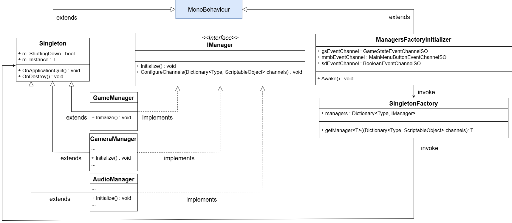
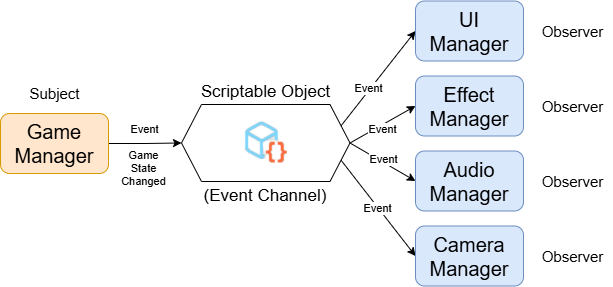
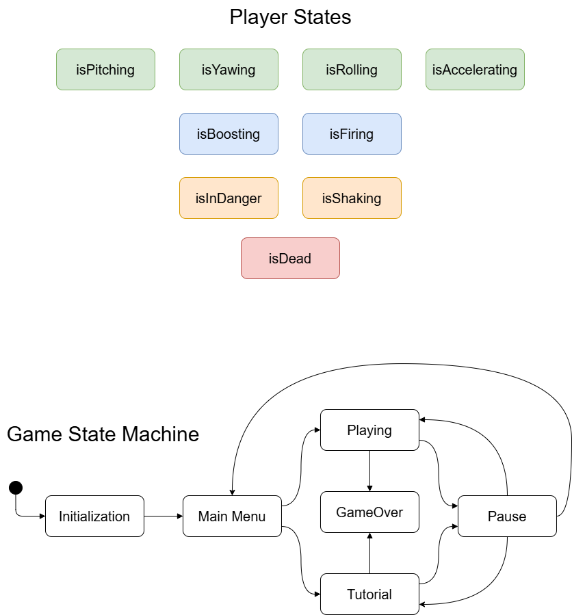
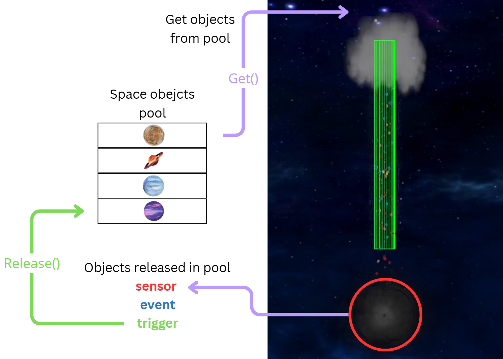

# Space Run 🚀

**Space Run** is an **endless space runner** developed in **Unity**, where players pilot a spaceship through a **wormhole-like tunnel**, dodging obstacles while being pursued by a **black hole**. The goal is to **travel as far as possible**, avoiding collisions with asteroids, satellites, and other celestial debris. The game integrates an **infotainment component**, featuring a **scaled representation of the Solar System**, with planets positioned at **proportional distances** and live scientific facts displayed in the HUD.

You can play the game by downloading it for free at the following link:
https://gabriele-ciccotelli.itch.io/grdualmindlab-spacerun

## Technologies & Design Patterns

### 🎮 Game Development
- Engine: **Unity** (C#)
- Physics-based obstacle spawning and ship movement
- Dynamic difficulty scaling based on progression

### 🏗 Software Architecture & Patterns
- **Factory & Singleton** – Used for creating and managing **managers**:
  
- **Observer Pattern** – Implements event-driven communication via **Scriptable Objects**, ensuring decoupled event management:
  
- **State Pattern** – Manages both **game states** (e.g., running, paused, game over) and **player states**:
  
- **Object Pooling** – Optimized instantiation of **obstacles and power-ups**, reducing performance overhead:
  
